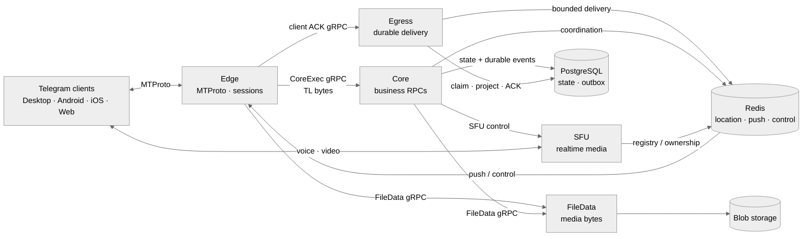

# gramsrv

**Own the server. Speak MTProto. Use real Telegram clients.**

`gramsrv` is an open-source Telegram-compatible server and MTProto backend
written in Go. It is built for self-hosted networks, protocol research, and
community-driven chat systems that need real client compatibility—not just a
Telegram-like interface.

This fork is based on [`iamxvbaba/gramsrv`](https://github.com/iamxvbaba/gramsrv).
The `Flashgram-OSS/gramsrv` repository preserves that upstream attribution and
adds the organization-specific integrations documented below.

[Website](https://telesrv.net) · [OwpenGram client](https://owpengram.org/) · [Discussion group](https://t.me/telesrv_chat) · [Channel](https://t.me/telesrv) · [中文 README](README.zh-CN.md)

<p align="center">
  
  
</p>

## Why gramsrv

Most Telegram clones reproduce the interface. `gramsrv` implements the server
side of the protocol so compatible clients can communicate through
infrastructure you control.

- Real MTProto transport, authentication, encrypted sessions, RPC dispatch,
  updates, and multi-device synchronization.
- A practical feature surface covering chats, channels, media, reactions,
  gifts, bots, calls, and administration.
- Open server code from the protocol edge to business services, storage, and
  realtime media.
- A Go codebase designed for compatibility work, experimentation, and
  long-term community development.

The protocol stack is built on the published
[`github.com/iamxvbaba/td`](https://github.com/iamxvbaba/td) module and follows
current Telegram Desktop wire behavior.

## Choose your architecture

| Branch | Architecture | Best fit |
|---|---|---|
| [`main`](../../tree/main) | Monolith | A straightforward single-process server for development, evaluation, and smaller deployments. |
| [`v2`](../../tree/v2) | Microservices | A split runtime with independent service boundaries for scaling, reliability, and production-oriented operation. |

## v2 at a glance



Connections stay at the Edge, business execution stays in Core, and reliable
delivery remains durable through Egress.

## What works today

- Accounts, contacts, profiles, privacy, presence, and multiple sessions.
- Private chats, groups, supergroups, channels, topics, invites, and public
  links.
- Durable updates, dialogs, read state, drafts, reactions, offline recovery,
  and multi-device synchronization.
- Photos, documents, stickers, GIFs, voice messages, previews, uploads, and
  downloads.
- Gifts and Stars, Premium flows, bots and mini apps, translation, and AI
  compose integrations.
- Private-call signaling, group calls, RTMP live streams, and standalone SFU
  ownership.

Telegram Desktop is the primary compatibility target. Android, iOS, and Web
client paths are also actively covered. Some advanced features remain
compatibility-first or experimental, but the implementation is open in this
repository.

## Clients

Stock Telegram clients trust Telegram's production data centers and RSA keys,
so they do not connect to private servers without a small endpoint and key
patch. Use a compatible client from the [project website](https://telesrv.net)
or build your own patched client.

[OwpenGram](https://owpengram.org/) is a multi-server Telegram-style client
with built-in support for `gramsrv`, private deployments, community nodes, and
the official network from one client experience.

## Build it with us

Compatibility reports, focused fixes, tests, and performance work are welcome.
The most useful reports include the client version, reproducible steps, and the
affected RPC or feature path.

Contributor: [ajarshia](https://github.com/ajarshia) — Android Persian (`fa`)
language pack.

## Deployment notes

When deploying `gramsrv` on a public server, open the following ports according
to the features you enable.

### Minimal public deployment (chat only)

| Port | Protocol | Purpose | Required |
|---|---|---|---|
| 2398 | TCP | MTProto main port; also handles WebSocket when `TELESRV_WEBSOCKET_ENABLE=true` | Yes |

### With Admin backend

| Port | Protocol | Purpose | Notes |
|---|---|---|---|
| 2399 | TCP | Admin REST API | Restrict to trusted IPs or put behind VPN |
| 2600 | TCP | Admin Web UI | Use Nginx/reverse proxy + HTTPS in production |

### Optional feature ports

| Port | Protocol | Purpose | When needed |
|---|---|---|---|
| 2400 | TCP | RTMP live stream ingest | Live streaming |
| 12399 | UDP | SFU/WebRTC conferencing | Voice/video group calls |
| 12400 | UDP | TURN/STUN server | P2P/call relay |
| 12500-12999 | UDP | TURN relay port range | TURN relay |
| configurable | TCP | Bot API | When `TELESRV_BOT_API_ADDR` is set |
| 2401 example | TCP | Public username/sticker/chatlist landing pages | When `TELESRV_PUBLIC_LINK_WEB_ADDR=127.0.0.1:2401` is set |

### Internal/debug ports (do not expose publicly)

| Port | Default bind | Purpose |
|---|---|---|
| 6060 | `127.0.0.1:6060` | pprof debugging endpoint |
| 5432 | `127.0.0.1:5432` | PostgreSQL |
| 6399 | `127.0.0.1:6399` | Redis |

Make sure `TELESRV_LISTEN=0.0.0.0:2398` is set, and `TELESRV_ADVERTISE_IP`
points to your public IP so clients can connect.

## Public Link Landing Pages

`gramsrv` can serve public landing pages for `/<username>`, profile avatars,
`/addstickers/<shortName>`, `/addemoji/<shortName>`, and `/addlist/<slug>`.
The same listener also serves the self-hosted Telegram-style `/botfather` and
`/stickers` mini-apps. Their browser API is under `/api/miniapps/*`, stays on
Gramsrv, and uses the existing bot/files services for database-backed creation.
State-changing calls require a signed Telegram `initData`; the user id in the
JSON body is never trusted. Configure the two service-bot tokens server-side
(`TELESRV_MINIAPP_BOTFATHER_TOKEN` and `TELESRV_MINIAPP_STICKERS_TOKEN`, each
as the matching built-in bot id plus secret) so Gramsrv can sign and verify
internal webviews. Tokens are never sent to the browser; a newly created bot
token is returned once in the HTTPS response only.

Use `TELESRV_PUBLIC_LINK_WEB_ADDR` as the local HTTP bind address:

```env
TELESRV_PUBLIC_LINK_WEB_ADDR=127.0.0.1:2401
```

Use `TELESRV_PUBLIC_BASE_URL` as the external canonical URL shown in generated
links:

```env
TELESRV_PUBLIC_BASE_URL=https://your-domain.example
TELESRV_PUBLIC_APP_SCHEME=yourapp
TELESRV_PUBLIC_WEB_BASE_URL=https://web.your-domain.example
TELESRV_PUBLIC_APP_NAME=YourApp
```

In production, keep `TELESRV_PUBLIC_LINK_WEB_ADDR` on loopback and reverse-proxy
the public routes to it with HTTPS.

## Client Compatibility

Stock Telegram clients will not connect to `gramsrv` because they trust
Telegram's production DC list and RSA keys. Use a patched experience client from
the [official website](https://telesrv.net), or build your own client with a
minimal protocol patch.

Current protocol baseline:

- Protocol module: `github.com/iamxvbaba/td` v1.3.1
- Canonical TL layer: 229
- Compatibility profiles: Layers 225, 227, 228, and 229
- Local DC: `127.0.0.1:2398`, DC id `2`

After `gramsrv` generates `data/server_rsa.pem`, export the matching public key:

```powershell
openssl rsa -in data/server_rsa.pem -RSAPublicKey_out -out data/server_rsa.pub
```

Patch `Telegram/SourceFiles/mtproto/mtproto_dc_options.cpp`:

1. Replace the built-in production/test DC lists with your `gramsrv` endpoint.
2. Replace both `kPublicRSAKeys` and `kTestPublicRSAKeys` with
   `data/server_rsa.pub`.
3. Add `Flag::f_tcpo_only` to the built-in DC flags.

Keep the client patch minimal: endpoint, RSA key, and TCP-only flags only.

## Multi-Device Smoke Test

Use separate client working directories so sessions do not share local `tdata`:

```powershell
$tdesktop = "C:\path\to\tdesktop\out\Debug\Telegram.exe"
Start-Process $tdesktop -ArgumentList @("-workdir", "$PWD\.tdata-alice")
Start-Process $tdesktop -ArgumentList @("-workdir", "$PWD\.tdata-bob")
```

Log in with different phone numbers. In local development, the login code is
`12345` unless you changed `TELESRV_DEV_AUTH_CODE`.

Recommended checks:

- Send private messages, stickers, media, replies, forwards, edits, deletes,
  and read receipts between two users.
- Keep one device online and restart another device to verify offline
  `updates.getDifference` recovery.
- Open the same account from multiple sessions and confirm current-session
  echoes are not duplicated while other online sessions receive updates.
- Check server logs for no new `NOT_IMPLEMENTED`, `Unhandled RPC`, `bad_msg`,
  panic, or internal errors.

## Contributors

- [ajarshia](https://github.com/ajarshia) - Android Persian (`fa`) language pack.

## Repository Layout

```text
cmd/telesrv/              server entrypoint
cmd/telesrv-admin/        admin backend and web UI
deploy/                   docker-compose, migrations, deploy helpers
data/                     bundled language packs and optional seed data
internal/mtprotoedge/     MTProto transport, auth key, session, ack/resend
internal/rpc/             TL router and client compatibility handlers
internal/app/             domain services
internal/domain/          protocol-independent domain models
internal/store/           memory/postgres/redis storage backends
internal/seed/            bundled seed catalog loaders
internal/sfu/             real-time SFU experiments
internal/turnsrv/         TURN/STUN building blocks
```

## TODO List

- Improve Bot compatibility for third-party libraries, such as `python-telegram-bot`.
- Fix known bugs and keep hardening existing compatibility paths.

## Help Improve It

`gramsrv` will get better fastest if more people run it, break it, profile it,
and send focused improvements. Helpful contributions include:

- Telegram Desktop and Android compatibility reports with reproducible steps.
- RPC traces for startup, sync, chat, media, calls, bots, or edge cases.
- Focused fixes for implemented paths instead of broad rewrites.
- Tests for online/offline updates, multi-device sessions, read state, media,
  and channel behavior.
- Performance work on hot paths such as fan-out, pagination, storage queries,
  media upload/download, and connection handling.
- Setup improvements that make the one-program local experience smoother.

If a change affects visible client behavior, please include the client
version/commit, the RPC path you tested, and whether server logs stayed free of
new `NOT_IMPLEMENTED`, `Unhandled RPC`, `bad_msg`, panic, or internal errors.

## License and independence

`gramsrv` is released under the [Apache License 2.0](LICENSE). You may use,
modify, distribute, and use it commercially under the terms of Apache-2.0. It
is independent and unofficial, and is not affiliated with, endorsed by, or
sponsored by Telegram or its official team.

## Custom Development

For paid custom development, you can contact the author through the discussion
group or website. Custom work can cover server features, Telegram Desktop,
Android, Web, deployment, compatibility adaptation, or other client/server
paths around this project.
